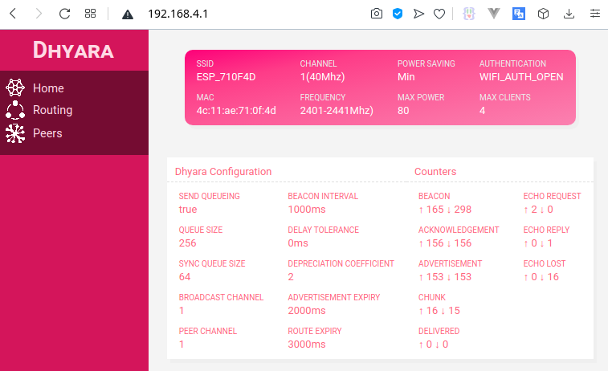

DHYARA
======

[GitHub Repository](https://github.com/neel/dhyara) | [Doxygen Documentation](http://neel.github.io/dhyara)

Dhyara is a ESP-IDF component for Mobile Ad-Hoc Networks on the top of ESP NOW (Layer 2). 
Dhyara is Open Source under BSD 2 Clause License. See [LICENSE](docs/LICENSE.md)

[TOC]



Basic Usage
-------------

The dhyara nodes identify each other via MAC address. 
Once deployed the nodes communicate with each other and each node builds a routing table based on its local view. 
On the top of that, dhyara provides C and C++ APIs for send/receice/ping/traceroute functionalities.

In the following example, the string "Hello World" is a variable length data which is sent to the destination identified with the mac address `4c:11:ae:9c:a6:85` over the multihop network. 
If the destination is a direct neighbour of the source then the message will be delivered in one hop.
Otherwise the message sent will find its path to the destination `4c:11:ae:9c:a6:85` on its own by following the routing decisions of each intermediate nodes.

~~~{.c}
uint8_t sink[] = {0x4c, 0x11, 0xae, 0x9c, 0xa6, 0x85};
dhyara_send(sink, "Hello World");
~~~

C++ version of the above mentined C example.

~~~{.cpp}
dhyara::peer_address sink("4c:11:ae:9c:a6:85");
std::string data = "Hello World";
dhyara_send(sink, data.begin(), data.end());
~~~

To receive the mesage sent over the network the sink node needs to register a callback where the data is received.

~~~{.c}
void data_received(const unsigned char* source, const void* data, unsigned long len){
    // data received here
}
dhyara_receivef(&data_received);
~~~

ESP Now limits maximum size of a frame to 250 bytes. 
The variable length data is represented as a data packet (\ref dhyara::packets::data), which is broken into multiple smaller sized chunks. 
On the receiving end these chunks are joined to comstruct a data packet, which is used while calling the receive callback set using \ref dhyara_receivef, \ref dhyara_receive, and \ref dhyara_receive_data.

~~~{cpp}
dhyara_receive_data([](const dhyara::peer::address& source, const dhyara::packets::data& data){
    std::cout << "received data " << " originating from " << data.source() << " via " << source << " of size " << data.length() << std::endl;
});
~~~

In the above mentioned C++ example, source represents the immediate neighbour of the desination, and `data.source()` is the originator of the message.


[Read More](\ref dhyara)

Compilation & Integration
--------------------------

Dhyara is a C++11 library that has to be used as an ESP-IDF component. 
It can be cloned to the `components` directory or can be used as a `git submodule` inside your projects `components` directory. 
If the application project is using an extra components directory then path to that directory has to be added in the root directory's CMakeLists.txt file as shown in the following example.

```
set(EXTRA_COMPONENT_DIRS ${CMAKE_CURRENT_SOURCE_DIR}/components)
```

To configure the network parameters use `idf.py menuconfig` in the aplications directory and Go to `Component config > Dhyara ad hoc network`
To build and flash the application use `idf.py build` and `idf.py flash` as usual.


See [Building the examples](docs/examples.md).

C Example
----------

The examples are provided in the examples directory. See [Building the examples](docs/examples.md) for instructions on building the examples.

Following is a C example demonstrating basic usage of dhyara
~~~{.c}

void data_received(const unsigned char* source, const void* data, unsigned long len){
    ESP_LOGI("hello-c", "data received \"%s\" (length %lu)", (const char*)data, len);
}

void app_main(){
    esp_err_t ret = nvs_flash_init();
    if (ret == ESP_ERR_NVS_NO_FREE_PAGES || ret == ESP_ERR_NVS_NEW_VERSION_FOUND) {
        ESP_ERROR_CHECK(nvs_flash_erase());
        ret = nvs_flash_init();
    }
    ESP_ERROR_CHECK(ret);
    
    ESP_ERROR_CHECK(dhyara_init(WIFI_MODE_AP));
    dhyara_start_default_network();
    
    dhyara_receivef(&data_received);

    uint8_t self[] = {0x0, 0x0, 0x0, 0x0, 0x0, 0x0};
    dhyara_local(self);
    
    ESP_LOGI("hello-c", "Local MAC address %x:%x:%x:%x:%x:%x", self[0], self[1], self[2], self[3], self[4], self[5]);
    
    uint8_t source[] = {0x4c, 0x11, 0xae, 0x71, 0x0f, 0x4d};  // TODO change the source address
    uint8_t sink[]   = {0x4c, 0x11, 0xae, 0x9c, 0xa6, 0x85};  // TODO change the sink address
    
    const uint8_t* other = 0x0;
    
    if(memcmp(self, source, 6) == 0) other = sink;
    if(memcmp(self, sink,   6) == 0) other = source;
    
    while(1){
        if(other){
            dhyara_ping(other, .count = 1, .batch = 10);
            dhyara_traceroute(other);
            dhyara_send(other, "Hello World");
            dhyara_send(other, "Hello World", 5);
        }
        vTaskDelay(pdMS_TO_TICKS(2000));
    }
}
~~~

C++ Example
-----------

Dhyara is primarily intended to be used for C++ application. 
To build a C++ application with ESP-IDF we first start from a `main.c` which calls a C++ function `mainx()`. 
Following is the `main.c` from the example `hello-cxx`

~~~{.c}

void app_main(){
    esp_err_t ret = nvs_flash_init();
    if (ret == ESP_ERR_NVS_NO_FREE_PAGES || ret == ESP_ERR_NVS_NEW_VERSION_FOUND) {
        ESP_ERROR_CHECK(nvs_flash_erase());
        ret = nvs_flash_init();
    }
    ESP_ERROR_CHECK(ret);
    
    ESP_ERROR_CHECK(dhyara_init(WIFI_MODE_AP));
    
    mainx(); // Enter C++
}

~~~

The `mainx()` is declared and gaurded by `extern C{}` block in the `mainx.h`, so that it can be included from c as well as C++.
Following is the definition of mainx() which can be found in the `mainx.cpp` in the `hello-cxx` example project.

~~~{.cpp}
void mainx(){
    dhyara::network network(dhyara_link());
    dhyara_set_default_network(&network);
    
    dhyara::peer_address sink("4c:11:ae:9c:a6:85"), source("4c:11:ae:71:0f:4d");

    dhyara_start_default_network();
    
    dhyara::peer_address local = dhyara_local();
    dhyara::peer_address other = (local == source) ? sink : ((local == sink) ? source : dhyara::peer_address::null());
    
    // The anonymous function will be called once all chunks of a data packet is received
    dhyara_receive_data([](const dhyara::peer::address& source, const dhyara::packets::data& data){
        std::cout << "received data " << " originating from " << data.source() << " via " << source << " of size " << data.length() << std::endl;
    });
    
    while(1){
        if(!other.is_null()){
            dhyara_ping(other, 1, 10);
            dhyara_traceroute(other);
            std::string buffer = "Hello World";
            dhyara_send(other, buffer.begin(), buffer.end());
        }
        vTaskDelay(pdMS_TO_TICKS(5000));
    }
} 
~~~


