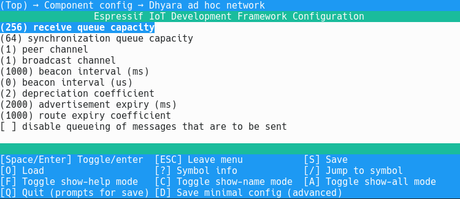

DHYARA
======

Dhyara is a ESP-IDF component for Mobile Ad-Hoc Networks on the top of ESP NOW (Layer 2). Dhyara is Open Source under BSD 2 Clause License. See [LICENSE](docs/LICENSE.md)

[Doxygen Documentation](http://neel.github.io/dhyara)


Basic Usage
-------------

The dhyara nodes identify each other via MAC address. 
Once deployed the nodes communicate with each other and each node builds a routing table based on its local view. 
On the top of that, dhyara provides C and C++ APIs for send/receice/ping/traceroute functionalities.

In the following example, the string "Hello World" is a variable length data which is sent to the destination identified with the mac address `4c:11:ae:9c:a6:85` over the multihop network. 
If the destination is a direct neighbour of the source then the message will be delivered in one hop.
Otherwise the message sent will find its path to the destination `4c:11:ae:9c:a6:85` on its own by following the routing decisions of each intermediate nodes.

~~~{.c}
uint8_t sink[] = {0x4c, 0x11, 0xae, 0x9c, 0xa6, 0x85};
dhyara_send(sink, "Hello World");
~~~

C++ version of the above mentined C example.

~~~{.cpp}
dhyara::peer_address sink("4c:11:ae:9c:a6:85");
std::string data = "Hello World";
dhyara_send(sink, data.begin(), data.end());
~~~

To receive the mesage sent over the network the sink node needs to register a callback where the data is received.

~~~{.c}
void data_received(const unsigned char* source, const void* data, unsigned long len){
    // data received here
}
dhyara_receivef(&data_received);
~~~

ESP Now limits maximum size of a frame to 250 bytes. 
The variable length data is represented as a data packet (\ref dhyara::packets::data), which is broken into multiple smaller sized chunks. 
On the receiving end these chunks are joined to comstruct a data packet, which is used while calling the receive callback set using \ref dhyara_receivef, \ref dhyara_receive, and \ref dhyara_receive_data.

~~~{cpp}
dhyara_receive_data([](const dhyara::peer::address& source, const dhyara::packets::data& data){
    std::cout << "received data " << " originating from " << data.source() << " via " << source << " of size " << data.length() << std::endl;
});
~~~

In the above mentioned C++ example, source represents the immediate neighbour of the desination, and `data.source()` is the originator of the message.

Compilation & Integration
--------------------------

Dhyara is a C++11 library that has to be used as an ESP-IDF component. 
It can be cloned to the `components` directory or can be used as a `git submodule` inside your projects `components` directory. 
If the application project is using an extra components directory then path to that directory has to be added in the root directory's CMakeLists.txt file as shown in the following example.

```
set(EXTRA_COMPONENT_DIRS ${CMAKE_CURRENT_SOURCE_DIR}/components)
```

To configure the network parameters use `idf.py menuconfig` in the aplications directory and Go to `Component config > Dhyara ad hoc network`
To build and flash the application use `idf.py build` and `idf.py flash` as usual.



See [Building the examples](docs/examples.md).

Guide
------

ESP wifi subsystem has to be started before starting the dhyara network.
`dhyara::link` provides the underlying communication layer over ESP NOW. 
The registered received callbacks should forward the received data to the `dhyara::link::_esp_rcvd_cb`.
Similarly the registered sent callback should forward the arguments to the `dhyara::link::_esp_sent_cb`.
A `dhyara::network` instance is created by using a reference to the `link`.
The network is started using nonblocking `dhyara::network::start` method, which creates multiple tasks to maintain the underlying network.
For rest of the application using dhyara, a reference to the `dhyara::network` is required.
So after starting the network, the application code should pass a reference to the network instance appopriately.
All nodes running dhyara will communicate with each other and transmit various packets to maintain the dynamic neighbourhood.

### Design

Dhyara uses many different packets for communication. 
The packets are defined in the \ref packets module. 
Type of a packet is identified using `dhyara::packets::type` enum.
Once a packet is received it is read and enqueued to a queue for further processing. 
Different actions have been defined to process different packets. 
The actions are defined in the \ref actions module.
The actions are installed to the `dhyara::link` by passing the packet type and a reference to the action to `dhyara::link::operator[]()` overload.
While dequeuing a packet it finds the appropriate action through the packet type and invokes the action.
The action may need to send some other packet in response.
For such circumstances the action may take a reference to the `dhyara::link` in its constructor.
Depending of the type of packet received, and the action installed, the received packet may be enqueued into another queue for further processing.
Each action provides a \ref dhyara::actions::action<DerivedT, PacketT>::connect "connect" method to bind a callback which will be called after the action have processed the incomming packet.
The `dhyara::network` provides functions to get reference to all installed actions.

### Usage

Being a network over L2 all nodes are identified through their MAC address. `dhyara::peer_address` abstracts a MAC address representation. 
ESP Now uses Wifi Action Frames to communicate, which limits maximuum size of a single packet to 250 bytes. 
So if the application want to send variable sized messages then dhyara may split that message into multiple chunks and send those packets to the desired destination through the best route over the ad hoc network. 
To send a message, use `dhyara::network::send`, which takes a destination address and `begin` and `end` iterators to the data that has to be sent.

Protocol Overview
------------------

Dhyara does not depend in IP layer. It uses MAC address to identify the nodes in the network. 
To establish an ad hoc network each nodes broadcasts beacon periodically which is acknowledged by its neighbourhood.
The multihop network is established by sharing the routes discoverd by each of these nodes. See [Protocol](docs/protocol.md) for details.

Additionally ICMP is implemented on the top of L2 to have a ping and traceroute like functionality.

Example
--------

See [Building the examples](docs/examples.md).


